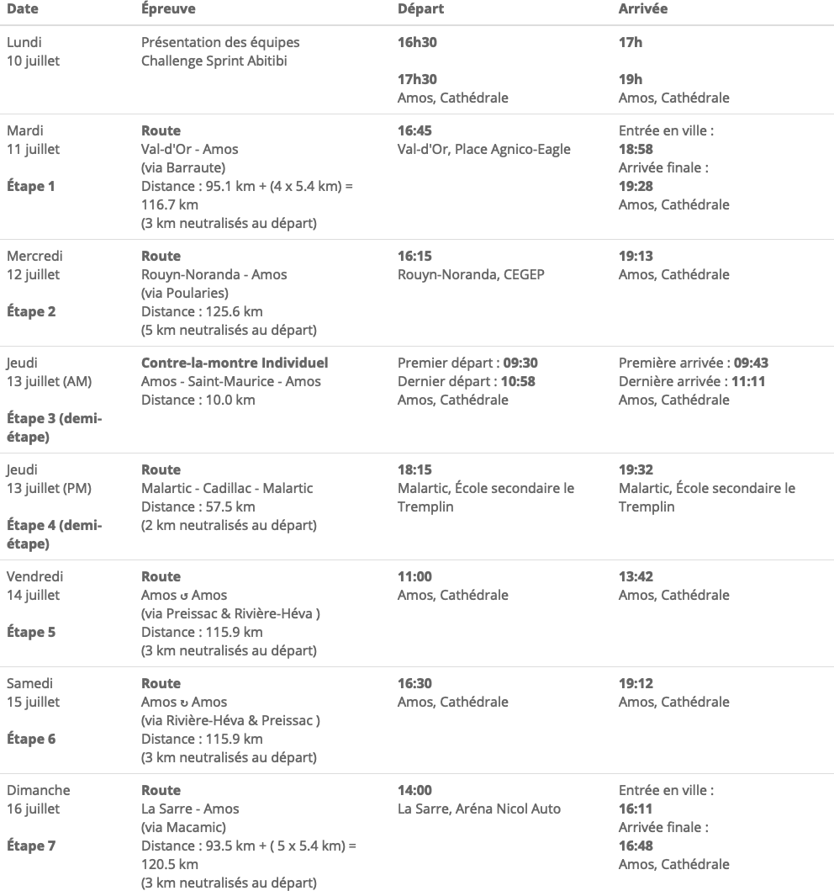

```{r here, include=FALSE}
# Gestion avec here
here::i_am("guide2023.Rproj")
```

```{r call_Libs_Vars, include=FALSE}
# Appel des librairies et variables partagées
source(here::here("code","_LibsVars.R"))

# Dates
source(here("code", "_Dates.R"))

# Pour accès aux données du fichier excel Itineraires.xlsx
source(here("code","programmation.R"))

# Pour accès au graphique d'élévation
source(here("code","graphique_denivele.R"))

# Langue
lang <- params$langue

# Edition  (52e en 2022)
edition <-params$annee - 2022 + 52

# Locale
## https://www.rdocumentation.org/packages/base/versions/3.6.2/topics/locales
{if (lang == "FR") Sys.setlocale("LC_TIME", locale = "fr_CA.UTF-8") 
  else Sys.setlocale("LC_TIME", locale = "en_US.UTF-8") }

opts_chunk$set( warning = FALSE,
                message = FALSE,
                quiet=TRUE)

```

\begin{titlepage}
\begin{center}

\huge{\textbf{Tour de l'Abitibi `r params$annee`}}\\

\vspace*{1.5cm}

\begin{figure}
  \centering    
  \includegraphics[width=0.3\linewidth]{../img/logo/TA_LogoCouleur_Fondransparent.png}
\end{figure}

\vfill

\line(1,0){400}\\[2mm]

\vspace*{0.5cm}
\huge{\textbf{GUIDE TECHNIQUE}}\\
\vspace*{1cm}
\Large{\textbf{53e édition}}\\
\vspace*{1cm}
\Large{Du `r params$dates_compl`}\\
\vspace*{0.5cm}
\line(1,0){400}\\[2mm]

\vfill

Version :  `r Sys.Date()` \\

\end{center}
\end{titlepage}

# Programmation


{#id .class width=100% height=100%}

\pagebreak


```{r, echo=FALSE}
Etape <-1


heureDep <- iti_etape$Details$time_depart[Etape]

heureArr <- iti_etape$Details$time_arrivee[Etape]

```

# Étape `r Etape` : `r iti_etape$Details$Descr_Villes[Etape]`

<br/>

**`r dates_FR %>% filter(code=="Mar") %>% pull(jsem_jour_mois_an)`** 

 **`r iti_etape$Details$KM_Total[Etape]` km**


Le commanditaire d'étape est **`r iti_etape$Details$Commanditaire[Etape]`**. 

## Sommaire

- `r iti_etape$Details$KM_Neutres[Etape]` km neutralisés au départ   
- Sans circuit d'arrivée

----------------------------------------------------
                                              Heure
----------------- ----------------------------------
Départ                                  `r heureDep`

Arrivée finale                         `r heureArr`
----------------------------------------------------

## Parcours

```{r, out.width="80%",fig.align='center',  echo = FALSE, eval = TRUE}

knitr::include_graphics(here("img", "cartes", "input",  glue("Etape{Etape}_Full.png")))

```


<br/>


[Ride with GPS](`r iti_etape$Details$Liens[Etape]`)

<br/>

### Détail du départ


```{r, out.width="80%",fig.align='center',  echo = FALSE, eval = TRUE}

knitr::include_graphics(here("img", "cartes", "input",  glue("Etape{Etape}_Dep.png")))

```

### Détail de l'arrivée

```{r, out.width="80%",fig.align='center',  echo = FALSE, eval = TRUE}

knitr::include_graphics(here("img", "cartes", "input",  glue("Etape{Etape}_Arr.png")))

```

## Élévation

```{r, out.width="100%",fig.align='center',  echo = FALSE, eval = TRUE}

knitr::include_graphics(here("img", "elev", glue("Etape{Etape}_Full_{lang}.png")))

```

```{r, out.width="100%",fig.align='center',  echo = FALSE, eval = TRUE}

knitr::include_graphics(here("img", "elev", glue("Etape{Etape}_Final_{lang}.png")))

```

## Description détaillée

```{r, out.width="100%" , fig.align='center', echo = FALSE, eval = TRUE}

knitr::include_graphics(here("guide_FR_PDF", "details",  glue("tableau_{Etape}.pdf")))

```


\pagebreak


```{r, echo=FALSE}
Etape <-2


heureDep <- iti_etape$Details$time_depart[Etape]

heureArr <- iti_etape$Details$time_arrivee[Etape]

```

# Étape `r Etape` : `r iti_etape$Details$Descr_Villes[Etape]`


<br/>

**`r dates_FR %>% filter(code=="Mer") %>% pull(jsem_jour_mois_an)`** 

 **`r iti_etape$Details$KM_Total[Etape]` km**


Le commanditaire d'étape est **`r iti_etape$Details$Commanditaire[Etape]`**. 

## Sommaire

- `r iti_etape$Details$KM_Neutres[Etape]` km neutralisés au départ   


----------------------------------------------------
                                              Heure
----------------- ----------------------------------
Départ                                  `r heureDep`

Arrivée finale                         `r heureArr`
----------------------------------------------------

## Parcours

```{r, out.width="80%",fig.align='center',  echo = FALSE, eval = TRUE}

knitr::include_graphics(here("img", "cartes", "input",  glue("Etape{Etape}_Full.png")))

```


<br/>


[Ride with GPS](`r iti_etape$Details$Liens[Etape]`)

<br/>

### Détail du départ


```{r, out.width="80%",fig.align='center',  echo = FALSE, eval = TRUE}

knitr::include_graphics(here("img", "cartes", "input",  glue("Etape{Etape}_Dep.png")))

```

### Détail de l'arrivée

```{r, out.width="80%",fig.align='center',  echo = FALSE, eval = TRUE}

knitr::include_graphics(here("img", "cartes", "input",  glue("Etape{Etape}_Arr.png")))

```

## Élévation

```{r, out.width="100%",fig.align='center',  echo = FALSE, eval = TRUE}

knitr::include_graphics(here("img", "elev", glue("Etape{Etape}_Full_{lang}.png")))

```

```{r, out.width="100%",fig.align='center',  echo = FALSE, eval = TRUE}

knitr::include_graphics(here("img", "elev", glue("Etape{Etape}_Final_{lang}.png")))

```

## Description détaillée

```{r, out.width="100%" , fig.align='center', echo = FALSE, eval = TRUE}

knitr::include_graphics(here("guide_FR_PDF", "details",  glue("tableau_{Etape}.pdf")))

```


\pagebreak


```{r, echo=FALSE}
Etape <-4


heureDep <- iti_etape$Details$time_depart[Etape]

heureArr <- iti_etape$Details$time_arrivee[Etape]

```

# Étape `r Etape` : `r iti_etape$Details$Descr_Villes[Etape]`

<br/>

**`r dates_FR %>% filter(code=="Jeu") %>% pull(jsem_jour_mois_an)`** 

 **`r iti_etape$Details$KM_Total[Etape]` km**


Le commanditaire d'étape est **`r iti_etape$Details$Commanditaire[Etape]`**. 

## Sommaire

- `r iti_etape$Details$KM_Neutres[Etape]` km neutralisés au départ   
- Sans circuit d'arrivée

----------------------------------------------------
                                              Heure
----------------- ----------------------------------
Départ                                  `r heureDep`

Arrivée finale                         `r heureArr`
----------------------------------------------------

## Parcours

```{r, out.width="80%",fig.align='center',  echo = FALSE, eval = TRUE}

knitr::include_graphics(here("img", "cartes", "input",  glue("Etape{Etape}_Full.png")))

```


<br/>


[Ride with GPS](`r iti_etape$Details$Liens[Etape]`)

<br/>

### Détail du départ


```{r, out.width="80%",fig.align='center',  echo = FALSE, eval = TRUE}

knitr::include_graphics(here("img", "cartes", "input",  glue("Etape{Etape}_Dep.png")))

```

### Détail de l'arrivée

```{r, out.width="80%",fig.align='center',  echo = FALSE, eval = TRUE}

knitr::include_graphics(here("img", "cartes", "input",  glue("Etape{Etape}_Arr.png")))

```

## Élévation

```{r, out.width="100%",fig.align='center',  echo = FALSE, eval = TRUE}

knitr::include_graphics(here("img", "elev", glue("Etape{Etape}_Full_{lang}.png")))

```

```{r, out.width="100%",fig.align='center',  echo = FALSE, eval = TRUE}

knitr::include_graphics(here("img", "elev", glue("Etape{Etape}_Final_{lang}.png")))

```

## Description détaillée

```{r, out.width="100%" , fig.align='center', echo = FALSE, eval = TRUE}

knitr::include_graphics(here("guide_FR_PDF", "details",  glue("tableau_{Etape}.pdf")))

```


\pagebreak


```{r, echo=FALSE}
Etape <-5


heureDep <- iti_etape$Details$time_depart[Etape]

heureArr <- iti_etape$Details$time_arrivee[Etape]

```

# Étape `r Etape` : `r iti_etape$Details$Descr_Villes[Etape]`

<br/>

**`r dates_FR %>% filter(code=="Mar") %>% pull(jsem_jour_mois_an)`** 

 **`r iti_etape$Details$KM_Total[Etape]` km**


Le commanditaire d'étape est **`r iti_etape$Details$Commanditaire[Etape]`**. 

## Sommaire

- `r iti_etape$Details$KM_Neutres[Etape]` km neutralisés au départ   
- Sans circuit d'arrivée
- Ascension finale hors category, doublant les points de GPM

----------------------------------------------------
                                              Heure
----------------- ----------------------------------
Départ                                  `r heureDep`

Arrivée finale                         `r heureArr`
----------------------------------------------------

## Parcours

```{r, out.width="80%",fig.align='center',  echo = FALSE, eval = TRUE}

knitr::include_graphics(here("img", "cartes", "input",  glue("Etape{Etape}_Full.png")))

```


<br/>


[Ride with GPS](`r iti_etape$Details$Liens[Etape]`)

<br/>

### Détail du départ


```{r, out.width="80%",fig.align='center',  echo = FALSE, eval = TRUE}

knitr::include_graphics(here("img", "cartes", "input",  glue("Etape{Etape}_Dep.png")))

```

### Détail de l'arrivée

```{r, out.width="80%",fig.align='center',  echo = FALSE, eval = TRUE}

knitr::include_graphics(here("img", "cartes", "input",  glue("Etape{Etape}_Arr.png")))

```

## Élévation

```{r, out.width="100%",fig.align='center',  echo = FALSE, eval = TRUE}

knitr::include_graphics(here("img", "elev", glue("Etape{Etape}_Full_{lang}.png")))

```

```{r, out.width="100%",fig.align='center',  echo = FALSE, eval = TRUE}

knitr::include_graphics(here("img", "elev", glue("Etape{Etape}_Final_{lang}.png")))

```

## Description détaillée

```{r, out.width="100%" , fig.align='center', echo = FALSE, eval = TRUE}

knitr::include_graphics(here("guide_FR_PDF", "details",  glue("tableau_{Etape}.pdf")))

```


\pagebreak


```{r, echo=FALSE}
Etape <-6


heureDep <- iti_etape$Details$time_depart[Etape]

heureArr <- iti_etape$Details$time_arrivee[Etape]

```

# Étape `r Etape` : `r iti_etape$Details$Descr_Villes[Etape]`

<br/>

**`r dates_FR %>% filter(code=="Mar") %>% pull(jsem_jour_mois_an)`** 

 **`r iti_etape$Details$KM_Total[Etape]` km**


Le commanditaire d'étape est **`r iti_etape$Details$Commanditaire[Etape]`**. 

## Sommaire

- `r iti_etape$Details$KM_Neutres[Etape]` km neutralisés au départ   
- Sans circuit d'arrivée

----------------------------------------------------
                                              Heure
----------------- ----------------------------------
Départ                                  `r heureDep`

Arrivée finale                         `r heureArr`
----------------------------------------------------

## Parcours

```{r, out.width="80%",fig.align='center',  echo = FALSE, eval = TRUE}

knitr::include_graphics(here("img", "cartes", "input",  glue("Etape{Etape}_Full.png")))

```


<br/>


[Ride with GPS](`r iti_etape$Details$Liens[Etape]`)

<br/>

### Détail du départ


```{r, out.width="80%",fig.align='center',  echo = FALSE, eval = TRUE}

knitr::include_graphics(here("img", "cartes", "input",  glue("Etape{Etape}_Dep.png")))

```

### Détail de l'arrivée

```{r, out.width="80%",fig.align='center',  echo = FALSE, eval = TRUE}

knitr::include_graphics(here("img", "cartes", "input",  glue("Etape{Etape}_Arr.png")))

```

## Élévation

```{r, out.width="100%",fig.align='center',  echo = FALSE, eval = TRUE}

knitr::include_graphics(here("img", "elev", glue("Etape{Etape}_Full_{lang}.png")))

```

```{r, out.width="100%",fig.align='center',  echo = FALSE, eval = TRUE}

knitr::include_graphics(here("img", "elev", glue("Etape{Etape}_Final_{lang}.png")))

```

## Description détaillée

```{r, out.width="100%" , fig.align='center', echo = FALSE, eval = TRUE}

knitr::include_graphics(here("guide_FR_PDF", "details",  glue("tableau_{Etape}.pdf")))

```


\pagebreak


```{r, echo=FALSE}
Etape <-7


heureDep <- iti_etape$Details$time_depart[Etape]

heureArr <- iti_etape$Details$time_arrivee[Etape]

```

# Étape `r Etape` : `r iti_etape$Details$Descr_Villes[Etape]`

<br/>

**`r dates_FR %>% filter(code=="Mar") %>% pull(jsem_jour_mois_an)`** 

 **`r iti_etape$Details$KM_Total[Etape]` km**


Le commanditaire d'étape est **`r iti_etape$Details$Commanditaire[Etape]`**. 

## Sommaire

- `r iti_etape$Details$KM_Neutres[Etape]` km neutralisés au départ   


----------------------------------------------------
                                              Heure
----------------- ----------------------------------
Départ                                  `r heureDep`

Arrivée finale                         `r heureArr`
----------------------------------------------------

## Parcours

```{r, out.width="80%",fig.align='center',  echo = FALSE, eval = TRUE}

knitr::include_graphics(here("img", "cartes", "input",  glue("Etape{Etape}_Full.png")))

```


<br/>


[Ride with GPS](`r iti_etape$Details$Liens[Etape]`)

<br/>

### Détail du départ


```{r, out.width="80%",fig.align='center',  echo = FALSE, eval = TRUE}

knitr::include_graphics(here("img", "cartes", "input",  glue("Etape{Etape}_Dep.png")))

```

### Détail de l'arrivée

```{r, out.width="80%",fig.align='center',  echo = FALSE, eval = TRUE}

knitr::include_graphics(here("img", "cartes", "input",  glue("Etape{Etape}_Arr.png")))

```

## Élévation

```{r, out.width="100%",fig.align='center',  echo = FALSE, eval = TRUE}

knitr::include_graphics(here("img", "elev", glue("Etape{Etape}_Full_{lang}.png")))

```

```{r, out.width="100%",fig.align='center',  echo = FALSE, eval = TRUE}

knitr::include_graphics(here("img", "elev", glue("Etape{Etape}_Final_{lang}.png")))

```

## Description détaillée

```{r, out.width="100%" , fig.align='center', echo = FALSE, eval = TRUE}

knitr::include_graphics(here("guide_FR_PDF", "details",  glue("tableau_{Etape}.pdf")))

```


\pagebreak