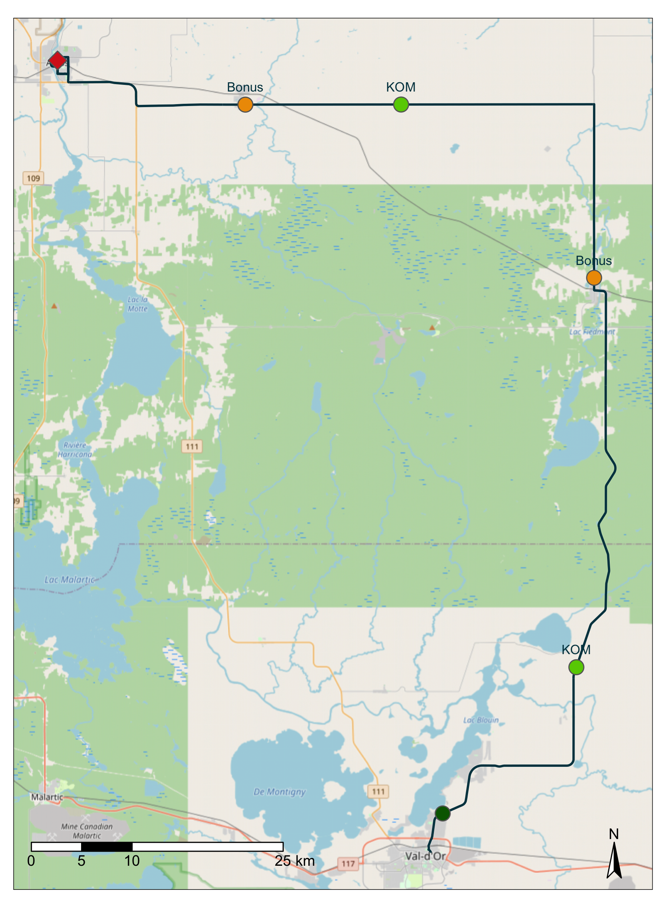

# img/cartes

Cartes de détails pour les départs arrivés

## input

Cartes brutes, produites par le script R `code/CartesStatiques.R`

### Exemple

## output

Cartes retravaillées dans ppt ou autres pour ajoutées des détails supplémentaires. 

Probablement des cartes d'arrivée principalement. 

